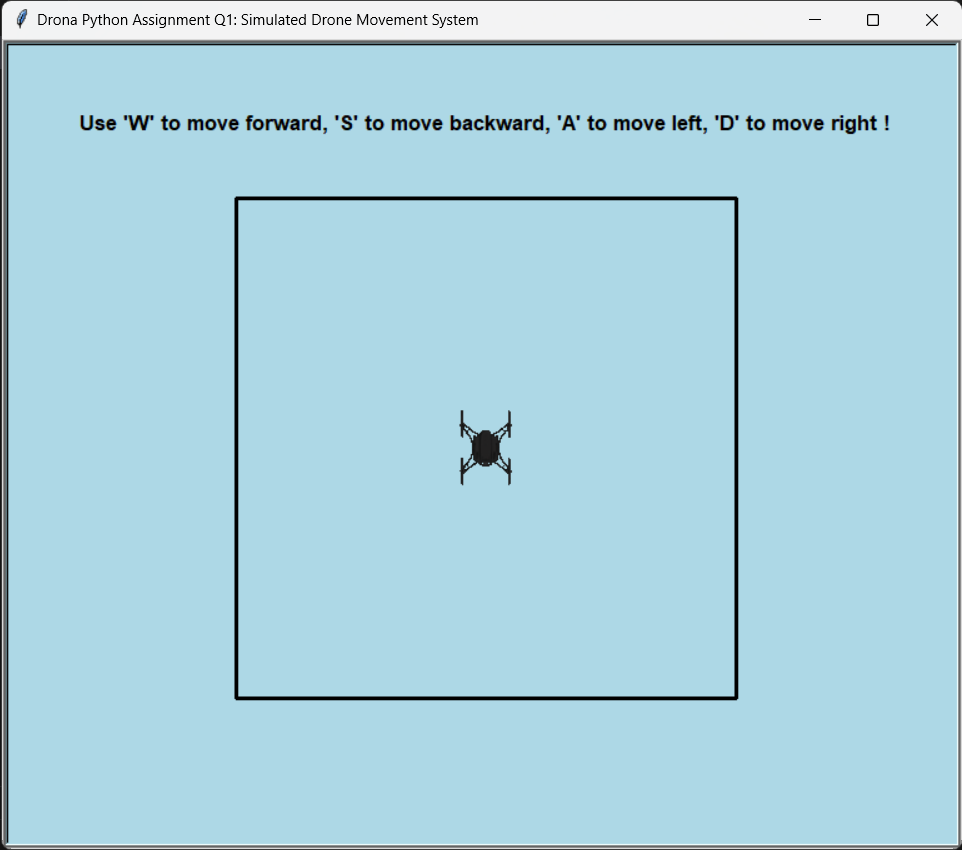
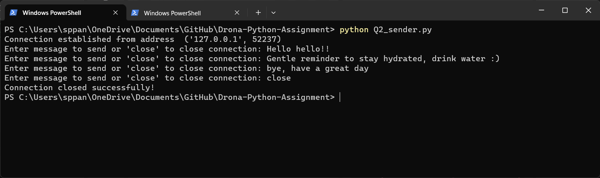
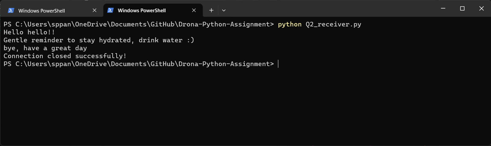

# Drona Python Assignment

This repository contains solutions to two Python tasks focusing on simulated drone movement using the Turtle module and TCP socket communication between sender and receiver programs.

## Problem 1: Simulated Drone Movement System

### Overview
This Python program simulates drone movement utilizing the Turtle module. The drone can navigate in four directions: forward, backward, left, and right.

### Instructions to Run
1. Ensure you have Python (3.6+) installed.
2. Clone this repository to your local machine.
3. Navigate to the repository directory.
4. Run the following command to execute the program:
    ```bash
    python Q1.py
    ```

### Output



## Problem 2: TCP Socket Communication

### Overview
This section consists of two Python programs enabling communication between a sender and receiver using TCP sockets.

### Instructions to Run
1. Ensure Python (3.6+) is installed.
2. Clone this repository to your local machine.
3. Navigate to the repository directory.
4. Open two terminals and follow these steps:

   - Terminal 1 (Receiver):
     ```bash
     python Q2_receiver.py
     ```

   - Terminal 2 (Sender):
     ```bash
     python Q2_sender.py
     ```

### Output


